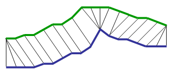

# dtw
[](https://github.com/shanghuiyang/dtw/actions)

dtw implements DTW([Dynamic Time Warping](https://en.wikipedia.org/wiki/Dynamic_time_warping)) algorithm using golang.

## Usage
```
package main

import (
	"fmt"
	"math"
	"os"

	"github.com/shanghuiyang/dtw"
)

func dist(x, y interface{}) float64 {
	xx := x.(int)
	yy := y.(int)
	diff := float64(xx - yy)
	return math.Sqrt(diff * diff)
}

func main() {
	s := []int{1, 3, 5}
	t := []int{2, 4, 6}

	dtw := dtw.New()
	d, err := dtw.Distance(s, t, dist)
	if err != nil {
		fmt.Printf("error: %v\n", err)
		return
	}
	path := dtw.Path()

	fmt.Printf("dtw distance: %v\n", d)
	fmt.Printf("path: %v\n", path)
	fmt.Println("matrix:")
	dtw.Draw(os.Stdout)
}
```
